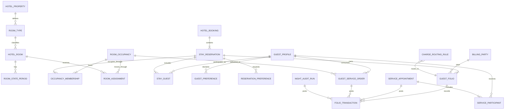
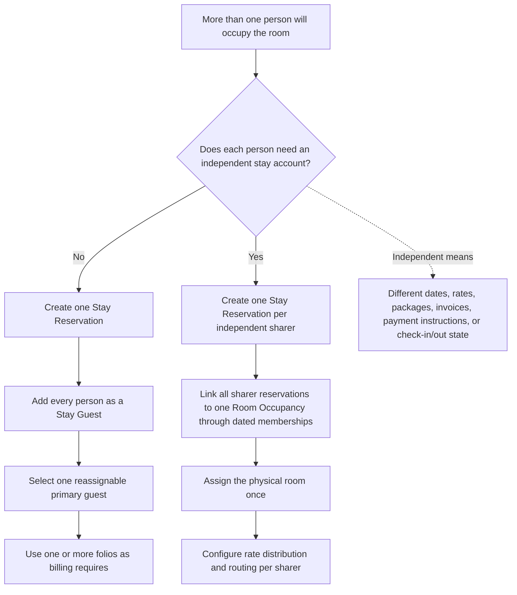
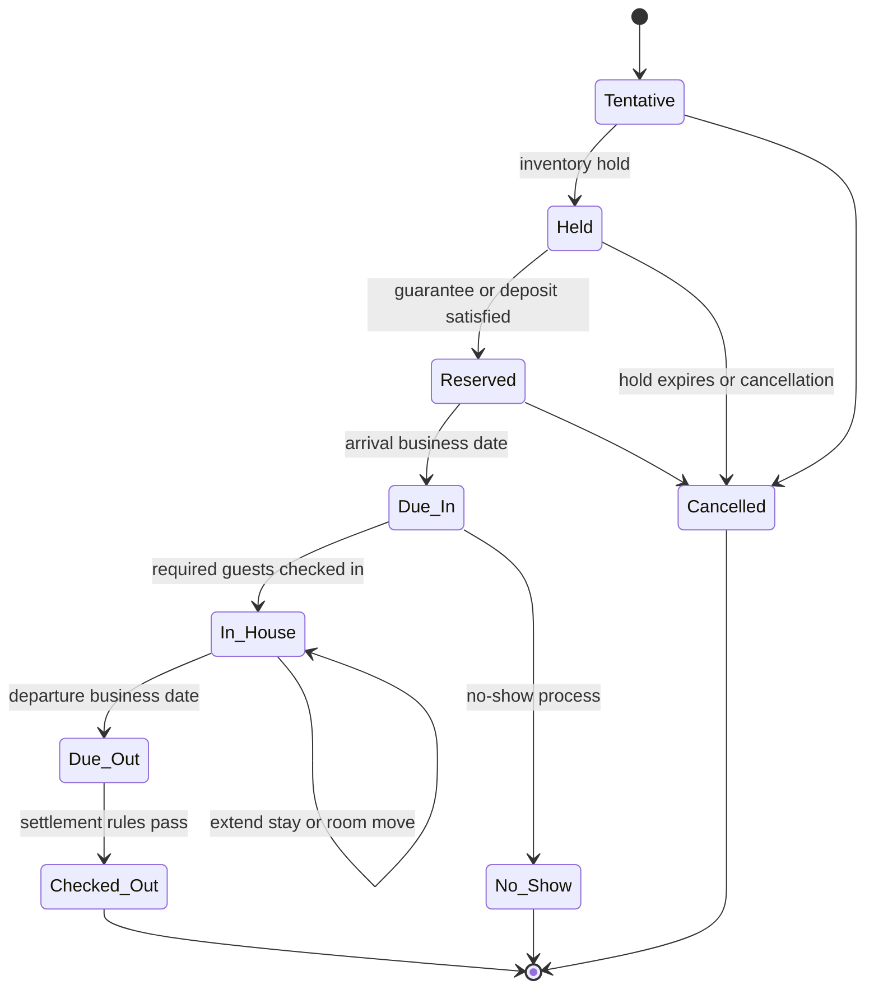
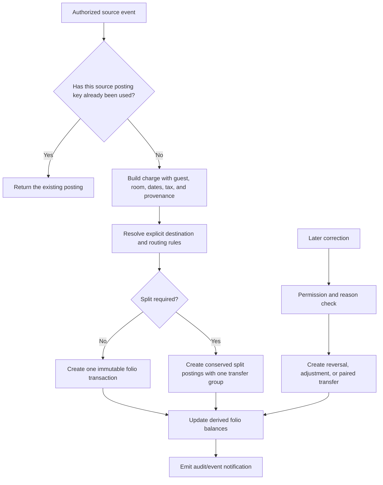
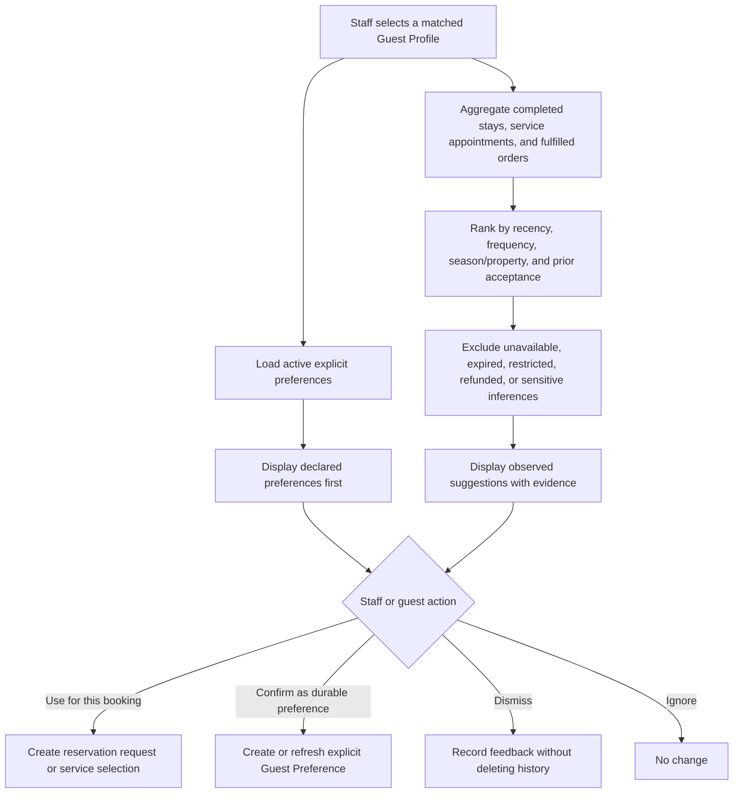
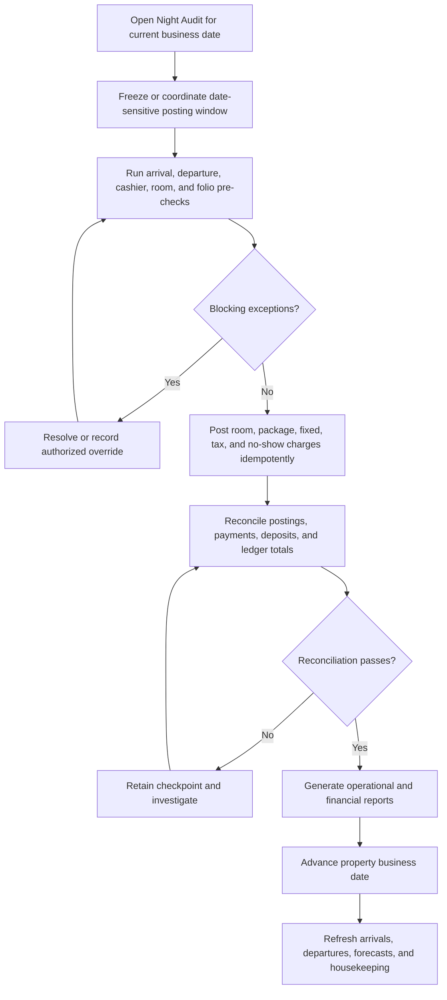

# Guest Folio and Hotel Property Management Design for Frappoint

| Document field | Value |
|---|---|
| Status | Proposed design |
| Document type | Product, domain, and implementation blueprint |
| Last reviewed | 31 August 2026 |
| Scope | Design only. It does not authorize or contain application-code changes. |

## 1. Executive recommendation

Frappoint should gain a hotel/property-management domain alongside its existing appointment domain. The hotel functionality should not be implemented by renaming or overloading `Service Booking`, `Service Appointment`, `Service Unit`, or `Sales Invoice`.

The recommended design has five core ideas:

1. Introduce a durable **Guest Profile** for every identifiable guest. The existing `Customer` remains the commercial/accounting party and may be linked to a Guest Profile, but it should not be the only guest identity record.
2. Separate the **booking**, the **physical room occupancy**, and each **stay reservation/account**. This supports ordinary couples, independent room sharers, multi-room groups, different arrival/departure dates, and separate bills without double-counting the room.
3. Record every actual occupant. A **primary guest is a role**, used for communication and default billing; it is not a substitute for recording the other occupants.
4. Treat a folio as an **operational guest subledger**, with immutable charges, credits, payments, transfers, and reversals. One stay may have several folios with different payees.
5. Keep three concepts independent for every item or service: **who consumed it**, **where it was delivered**, and **who must pay for it**.

The target relationship is therefore:

> A booker makes a booking; the booking contains one or more stay reservations; stay reservations occupy one or more rooms; every occupant has a guest profile; services and items identify their consumer; and routing rules determine the folio and legal payee that receive each charge.

This design preserves the strengths of Frappoint—service scheduling, providers, timed capacity, payments, and ERPNext integration—while adding the date-based inventory, front-office, guest-ledger, housekeeping, and hotel accounting behavior that a full property management system requires.

## 2. Goals and boundaries

### 2.1 Goals

The module should:

- Manage reusable guest identities, contact details, documents, relationships, consent, preferences, notes, stay history, and service history.
- Manage properties, room types, physical rooms or beds, amenities, capacity, sellability, room condition, housekeeping, and maintenance.
- Quote, hold, confirm, amend, cancel, check in, move, extend, and check out hotel stays.
- Support single-room, multi-room, couple, family, sharer, group, corporate, walk-in, and booked-on-behalf scenarios.
- Assign rooms, items, appointments, and other services to the correct guest or guests.
- Maintain one or more folios per stay, with charge routing, splitting, transfers, payments, refunds, deposits, tax, invoicing, and accounts-receivable handling.
- Suggest relevant preferences and previously completed service types when a returning guest is selected.
- Integrate with the current Frappoint booking desk, service appointment engine, ERPNext Items, stock, accounting, and payment facilities.
- Provide operational boards and reports for front desk, housekeeping, finance, management, and guest-service teams.
- Preserve a complete audit trail and protect guest data.

### 2.2 Boundaries

The initial architecture should allow, but does not need to deliver all of the following in the first release:

- OTA and channel-manager connectivity.
- A public hotel booking engine.
- Door-lock/key-card integration.
- Passport or identity-document scanning.
- Revenue-management optimization and dynamic pricing.
- Loyalty points and membership tiers.
- Multi-property central reservations.
- Restaurant POS, minibar hardware, telephony, and pay-TV integrations.

These are later integrations. The core data model must not prevent them.

### 2.3 Important terms

| Term | Meaning in this design |
|---|---|
| Guest Profile | Durable record for a person who books, stays, consumes a service, or pays. |
| Customer | ERPNext commercial/accounting party. It may be a person or an organization and may be linked to a Guest Profile. |
| Hotel Booking | Umbrella commercial booking, including source, booker, guarantee, policies, and one or more stay reservations. |
| Room Occupancy | The physical use of one room or bed over an interval. It is counted once in inventory even when several independent sharers occupy it. |
| Stay Reservation | A guest-facing reservation/account within a booking, connected to physical Room Occupancies through effective-dated memberships. It owns dates, entitlements, rate responsibility, occupants, and folios. |
| Occupancy Membership | Effective-dated relationship connecting a Stay Reservation to the Room Occupancy it shares. It preserves history when sharers join, separate, or move independently. |
| Stay Guest | Relationship between a Guest Profile and a Stay Reservation, including role and individual check-in state. |
| Companion | Additional occupant using the lead guest's stay account, dates, and default folio. |
| Sharer | Occupant with an independent Stay Reservation/account and potentially separate dates, rates, entitlements, or folios, while sharing a Room Occupancy. |
| Folio | Operational account or billing window for a payee. A stay can have more than one. |
| Folio Transaction | Immutable monetary posting such as a charge, credit, payment, refund, transfer, tax, or reversal. |
| Business Date | The hotel's operational date, advanced by the end-of-day process; it may differ from the wall-clock date around midnight. |

### 2.4 Feature priority and definition of done

| Priority | Capabilities | Product meaning |
|---|---|---|
| Core folio — required | Durable guest/stay links; multiple folios/payees; immutable charge/payment/tax/reversal records; pending versus posted activity; routing/splitting/transfers; deposits/refunds; settlement; invoices/receipts; AR option; audit and reconciliation. | Without these, the feature is a booking total or invoice screen, not a dependable guest folio. |
| Hotel PMS launch — required | Room types/rooms; rate and policy snapshots; availability and holds; Hotel Booking, Room Occupancy, Stay Reservation, every Stay Guest; companion/sharer/group handling; assignments and room moves; check-in/out; housekeeping; business date/night audit; front-desk and finance reports. | Without these, Frappoint may sell accommodation but cannot safely operate a hotel. |
| Integrated guest experience — required for the requested enhancement | Item and Service Type reuse; Service Participant attribution; Guest Service Orders; consumer/location/payee separation; returning-guest history; declared preferences and evidence-backed service suggestions. | This connects the existing appointment capability to the hotel stay and guest relationship. |
| Advanced/next stage | OTA/channel manager, public booking engine, locks, ID scanning, loyalty, POS/hardware integrations, revenue optimization, and central multi-property reservations. | The architecture must allow these, but they need not block the first controlled hotel launch unless the target property requires them. |

## 3. Current Frappoint baseline

Frappoint already contains valuable parts of the solution, but their current semantics are appointment-oriented.

| Existing capability | Current behavior | Reuse decision | Hotel/PMS gap |
|---|---|---|---|
| `Service Booking` | One required ERPNext Customer, service item rows, aggregate totals, deposit requirement, payment status, and linked appointments. | Keep for service commerce and link it to a hotel booking/stay when relevant. | It has no arrival/departure range, room-night inventory, occupants, room moves, multiple payees, or folio ledger. Its guest total is currently derived from service-item quantities. |
| `Service Appointment` | Timed service, provider, optional service unit, guest child rows, capacity, payment, check-in/progress/completion states, and invoicing. | Keep as the scheduled-service execution record. Add hospitality links later through a defined bridge. | It is not an overnight accommodation reservation and should not become one. |
| `Service Appointment Guest` | Child snapshot containing name, email, phone, primary flag, and notes. | Preserve for backward compatibility and service snapshots. Resolve/link it to Guest Profile when possible. | It has no durable guest identity, deduplication, stay history, preferences, consent, individual status, or payer relationship. |
| `Service Unit` | Tree-based service resource with location, capacity, overlap, and appointment flags. | Optionally link a Hotel Room to a Service Unit where one physical room is also a service resource. | A hotel room needs room type, nightly inventory, housekeeping state, sellability outages, amenities, beds, and rate behavior. |
| `Service Resource Allocation` | One-date, time-of-day allocation tied to a Service Appointment, with buffers and capacity. | Reuse its locking and allocation lessons, not its hotel semantics. | Hotel inventory uses arrival/departure intervals and room nights. A room must remain available for same-day turnover but unavailable for overlapping stays. |
| `Service Appointment Payment` and ERPNext invoice integration | Payments reference bookings or appointments; Sales Invoices can be created at booking or appointment level. | Reuse payment gateways, Payment Entry, Sales Invoice, Item, tax, and account masters. | A folio needs multiple payees, deposits, charge routing, partial transfers, night postings, reversals, settlement, and AR/city-ledger handling. |
| Booking Desk | Vue-based service selection, guest assignment, availability, checkout, operational dashboard, and payment flow. | Extend into a unified hospitality/front-desk workspace. | It needs a tape chart, room search, stay details, all occupants, folios, arrivals/departures, housekeeping, and night audit. |

Relevant current definitions include:

- [Service Booking](frappoint/frappoint/doctype/service_booking/service_booking.json)
- [Service Booking controller](frappoint/frappoint/doctype/service_booking/service_booking.py)
- [Service Appointment](frappoint/frappoint/doctype/service_appointment/service_appointment.json)
- [Service Appointment Guest](frappoint/frappoint/doctype/service_appointment_guest/service_appointment_guest.json)
- [Service Unit](frappoint/frappoint/doctype/service_unit/service_unit.json)
- [Service Resource Allocation](frappoint/frappoint/doctype/service_resource_allocation/service_resource_allocation.json)
- [Service Appointment Payment](frappoint/frappoint/doctype/service_appointment_payment/service_appointment_payment.json)

### 3.1 Consequences for the design

- Do not convert `Service Appointment Guest` into the master guest record. It is an event snapshot and may contain duplicate or incomplete people.
- Do not use `Service Booking.items` as a folio. Those rows describe what was booked, not an immutable history of financial events.
- Do not use a `Sales Invoice` as the live folio. The invoice is an accounting/fiscal outcome; the folio is the changing operational subledger before settlement.
- Do not use the current timed allocation alone for hotel occupancy. Build a date-range accommodation allocator with explicit room-night rules.
- Do reuse ERPNext accounting, Items, Customers, Companies, taxes, warehouses, Payment Entries, and Sales Invoices instead of rebuilding those systems.

## 4. Architectural principles and invariants

1. **A person, a reservation, a room, and a payer are different entities.** They may coincide in a simple booking, but the model must not assume that they do.
2. **Primary is a role, not ownership of everyone else's identity.** Each actual occupant is independently represented and searchable.
3. **Physical occupancy and commercial accounts are separate.** Two sharers can have independent accounts while consuming one room from inventory.
4. **Consumption and liability are separate.** The guest receiving a massage may not be the guest or company paying for it.
5. **Folio transactions are append-only after posting.** Corrections use transfers, adjustments, or reversals with reasons and authorization.
6. **Financial source documents are idempotent.** Retrying a service completion, POS posting, night audit, or gateway callback must not duplicate a charge or payment.
7. **Operational dates are explicit.** Service date, posting timestamp, accounting date, and business date must not be collapsed into one value.
8. **Room state has independent dimensions.** Occupancy, housekeeping condition, and sellability/maintenance must not be represented by one status field.
9. **A room move creates new dated allocation segments.** It does not overwrite history.
10. **Observed behavior is a suggestion, not a declared preference.** The system never silently converts an inference into a permanent guest preference.
11. **Legal and private data are minimized.** Access, unmasking, printing, exporting, merging, and deletion/anonymization are permissioned and audited.
12. **The hotel domain remains compatible with standalone service bookings.** A spa or appointment customer must not be forced to create a hotel stay.

## 5. Proposed domain model

### 5.1 High-level relationship model

`BILLING_PARTY` is conceptual: the actual payee may resolve to a Guest Profile or an ERPNext Customer representing a person, employer/corporate account, travel agent, group master, or another approved party type. ERPNext `Company` remains the property's operating/legal entity, not the guest's employer account.

### 5.2 Why both Room Occupancy and Stay Reservation exist

The separation solves the shared-room problem without corrupting availability:

| Scenario | Room Occupancy records | Stay Reservation records | Guest records | Folios |
|---|---:|---:|---:|---:|
| Solo traveller | 1 | 1 | 1 | 1 or more |
| Couple, same dates and one account | 1 | 1 | 2 Stay Guests | 1 or more |
| Two independent sharers | 1 | 2 | At least 2 | At least 2, normally one per sharer |
| Family in one room | 1 | 1 | Every adult and the policy-required data for minors | 1 or more |
| Three-room group booking | 3 | At least 3 | All named occupants | Guest folios plus optional group/master folio |
| Room move during a stay | 1 | Unchanged | Unchanged | Unchanged; two or more Room Assignment segments |

Inventory counts Room Occupancy/Room Assignment, not the number of sharer accounts. This prevents two sharers in room 201 from consuming two rooms.

### 5.3 Proposed business records

The names below are recommendations; final DocType naming should be confirmed before implementation.

| Record | Responsibility | Essential information and rules |
|---|---|---|
| Hotel Property | Operational property tied to an ERPNext Company and default currency. | Time zone, business date, check-in/out times, warehouses, tax templates, default accounts, numbering, policies, and feature flags. |
| Room Type | Sellable accommodation category. | Capacity by adult/child, bed configuration, description, amenities, accessibility features, standard occupancy, and overbooking policy. |
| Hotel Room | Physical room, suite, cabin, villa, or bed. | Property, room type, room number, building/floor, capacity override, features, housekeeping zone, active/sellable state, and optional linked Service Unit. |
| Room State Period | Dated housekeeping, maintenance, out-of-service, or out-of-order fact. | State dimension, reason, effective interval, inventory impact, reporter, assignee, resolution, and audit data. |
| Rate Plan | Commercial room offering. | Currency, meal/package inclusions, cancellation/deposit policy, occupancy rules, tax behavior, market/source restrictions, and daily rate derivation. |
| Hotel Booking | Umbrella commercial transaction. | Booker, booking source/channel, property, market/source codes, group/company/travel-agent links, guarantee, policy snapshot, overall status, and linked stay reservations. |
| Room Occupancy | Physical use of accommodation, counted once in inventory. | Required room type, occupancy interval, adult/child totals, allocation state, room-share mode, capacity, and one or more dated Room Assignments. |
| Occupancy Membership | Effective-dated link between a Stay Reservation/account and a Room Occupancy. | Start/end, companion/share context, join/separate/move reason, previous/next membership, and audit data. A simple stay has one membership; a sharer who separates mid-stay receives another. |
| Stay Reservation | Independent guest reservation/account accommodated through one or more effective-dated Occupancy Memberships. | Arrival/departure, rate plan, daily rates, entitlements, lead guest, status, guarantee/payment instructions, shares of room rate, and folios. |
| Stay Guest | Relationship between a guest and a stay. | Guest Profile, role, adult/child category, relationship/guardian where needed, expected and actual join/leave times, registration completion, individual check-in/out state, charge privilege, and default personal folio. |
| Room Assignment | Immutable-effective segment assigning a Room Occupancy to a physical room. | Start/end, room, assignment/lock status, move reason, previous segment, assigned by, and turnover constraints. |
| Guest Profile | Durable person identity. | Names, contacts, language, address, nationality, permitted identity metadata, consent, privacy flags, linked Customer/Contact/User, relationships, VIP/restriction markers, and duplicate status. |
| Guest Preference | Explicit, durable preference confirmed for a Guest Profile. | Category, value, priority, source, sensitivity, property scope, effective dates, last confirmed date, consent basis, and active state. |
| Reservation Preference | Stay-specific request that does not automatically alter the durable profile. | Guest, stay, category, value, status, fulfillment notes, and an explicit action to copy it to the profile when appropriate. |
| Guest Folio | Operational billing window for one payee. | Stay, folio number/name, payee, invoice addressee, payment method/instructions, currency, routing priority, posting permissions, totals, and lifecycle status. |
| Folio Transaction | Immutable financial posting. | Direction, transaction type, charge code, positive amount, tax components, currency, business/service/accounting dates, source document, source-line key, consumer guest, room snapshot, destination folio, operator, reason, and reversal/transfer lineage. |
| Charge Routing Rule | Rule assigning future charges to a folio or another reservation/master account. | Scope, charge code/category, source/department, consuming guest, date range/days, limit, destination, split method, priority, and active state. |
| Service Participant | Guest-level relationship for a scheduled Service Appointment. | Guest Profile, Stay Guest/Stay Reservation, participant role, service/pricing share, status, consent/waiver where applicable, and default charge destination. This supports one or many service consumers per appointment. |
| Guest Service Order | Operational order for non-appointment goods and services. | Consumer, requester, delivery location, items, department, fulfillment state, complimentary/house-use authorization, and folio destination. Scheduled services continue to use Service Appointment. |
| Night Audit Run | Idempotent end-of-day batch. | Property, business date, run status, checkpoints, posting keys, exceptions, operator, totals, reports, and next business date. |
| Housekeeping Task | Work instruction related to a room/occupancy. | Task type, schedule, room, stay instructions, assignee, priority, status, inspection, supplies, and timestamps. |

### 5.4 Snapshot versus master data

Master records change over time. Operational and financial records must retain the facts that applied at the time.

- Guest Profile is the current reusable identity; Stay Guest retains the name/contact/registration snapshot used for that stay where legally or operationally required.
- Room Type and Hotel Room are current masters; Room Assignment and Folio Transaction retain room/type snapshots.
- Rate Plan is a reusable rule; Stay Reservation retains the accepted daily-rate and policy snapshots.
- Item, Service Type, tax template, and charge code are masters; Folio Transaction retains description, price, quantity, tax, and account snapshots.
- Updating a guest's address or an item's name later must not rewrite a closed folio or issued invoice.

## 6. Guest roles and attribution

### 6.1 Roles that must remain distinct

| Role | Example | System use |
|---|---|---|
| Booker | An assistant books for an executive. | Confirmation contact, source attribution, amendment authority. |
| Lead/primary guest | One partner is the primary contact. | Arrival communication and default decisions; reassignable. |
| Occupant | Both partners stay in the room. | Registration, safety, room capacity, individual check-in, guest history. |
| Requester | One partner orders room service for the room. | Operational trace and authorization. |
| Consumer/beneficiary | The other partner receives a massage. | Service history, preference suggestions, waivers, provider notes. |
| Payee | The employer pays room and breakfast. | Destination folio and settlement responsibility. |
| Invoice addressee | The employer's legal name and tax address. | Sales Invoice and printed fiscal document. |
| Payer | The guest's card settles personal incidentals. | Payment instrument and payment allocation. |

One person may fill several roles, but the data model must not derive one role from another.

### 6.2 How rooms, items, and services are assigned

| Thing being assigned | Correct operational relationship | Financial relationship |
|---|---|---|
| Physical room | Assign the room to Room Occupancy for an effective interval; obtain its occupants through Stay Reservation and Stay Guest. | Nightly room charge is allocated by the stay's room-rate distribution and routing rules. |
| Scheduled service | Service Appointment has one or more Service Participants. Each participant identifies the consumer Guest Profile, related Stay Guest/Stay Reservation, and optional delivery Room Occupancy/room snapshot. | Appointment completion or the configured posting milestone creates the required idempotent charge allocation(s) in the selected/routed folio(s). |
| Unscheduled service or item | Guest Service Order identifies requester, consumer, delivery room, and fulfillment source. | Fulfillment posts to the routed folio; stock movement remains tied to fulfillment, not to later folio transfers. |
| Package entitlement | Entitlement belongs to a Stay Reservation and may be consumed by an eligible Stay Guest. | Included consumption does not create a new guest debit unless allowance is exceeded; revenue allocation follows the package accounting design. |
| Payment | Payment is made by a payer and allocated to one or more folios. | The payment reduces only the balances to which it is allocated. |

The user interface may say “Room assigned to Alice and Bob,” but internally the room is assigned to their Room Occupancy. This indirection is what makes room moves, shared rooms, and date history reliable.

## 7. Couples, families, and multiple people in one room

### 7.1 Decision

**Do not focus on the primary guest only.** Record all actual occupants, while using one reassignable primary guest for contact and default behavior.

Use two explicit shared-room modes:

| Mode | Use it when | Account and folio behavior |
|---|---|---|
| Companion | Guests share dates, room entitlement, and a common reservation account. This is the normal couple/family case. | One Stay Reservation contains multiple Stay Guests. The primary folio is the default, but additional folios may still split personal/company charges. |
| Independent sharer | A guest needs independent dates, rate/package entitlement, payment instructions, folio, invoice, or check-in/out lifecycle. | Create a separate Stay Reservation for each independent sharer, link them to the same Room Occupancy through dated Occupancy Memberships, and count the room only once. |
| Group/multi-room | One booker controls several rooms or reservations. | One Hotel Booking contains multiple Room Occupancies and Stay Reservations, with per-room folios and an optional group/master folio. |

This matches the useful distinction made by Oracle OPERA between accompanying guests and share reservations: accompanying guests occupy the room without independent reservation accounts, while sharers have independent accounts and may have different dates and folios.

### 7.2 Shared-room decision flow

### 7.3 Rules for all multi-guest stays

- Exactly one active primary contact should exist per ordinary Stay Reservation; changing the primary must be audited.
- A Room Occupancy may contain several primary guests only when it contains several independent sharer reservations.
- Independent sharers may share a Room Occupancy only when their stay dates overlap by at least one room night. Sequential, non-overlapping stays use separate Room Occupancies even if they use the same Hotel Room.
- Sharer Stay Reservations may originate in the same Hotel Booking or in separate bookings combined by an authorized front-desk action. Combining the physical occupancy must not merge or erase their original booking identities.
- Occupancy Membership dates determine which stay accounts share each room night. Membership coverage must be continuous for every in-house Stay Reservation unless an explicit accommodation gap is supported.
- Every adult occupant should have a Guest Profile, subject to property policy and applicable law. For minors, collect only necessary data and record the responsible guardian/relationship.
- Each Stay Guest has an individual expected/actual arrival and departure and registration/check-in status.
- Capacity validation uses the active occupants for each night, not just a header guest count.
- Staff can search a reservation by any current or historical occupant, not only the primary name.
- A companion is not automatically allowed to view another guest's folio, service history, contact details, or identity data.
- Room-charge distribution can be entire-to-one, equal split, percentage split, fixed amount, or custom by date. The sum must always equal the original room charge.
- One guest's departure must not check out the other occupants or close their folios unless an explicit group action is confirmed.
- A shared room cannot be separated in-house by simply changing a room field. Moving all sharers together creates a new Room Assignment segment on the same Room Occupancy. Moving only one sharer closes that sharer's Occupancy Membership and creates a new Room Occupancy, membership, and room assignment for the remaining interval.

### 7.4 Representative scenarios

| Scenario | Recommended records and routing |
|---|---|
| Couple, one card, one invoice | One Room Occupancy, one Stay Reservation, two Stay Guests, one default folio. Services still record the actual consumer. |
| Couple, split all costs 50/50 | Prefer one Room Occupancy and two sharer Stay Reservations if each needs a separate legal bill; distribute nightly room charges equally and route personal services by consumer. |
| Business guest with spouse | One or two Stay Reservations depending on independent billing needs. Route approved room, tax, and meal codes to the employer folio; route alcohol, spa, gifts, and spouse services to personal folio(s). |
| Friends with staggered departure | One Room Occupancy, separate sharer Stay Reservations and effective-dated Occupancy Memberships with their own dates and folios. Capacity and rate distribution change on the departure date. |
| Parent and child | One Stay Reservation, both represented as Stay Guests, adult is primary/guardian; store only required child data. |
| Assistant books three rooms | Assistant is Booker, not automatically an occupant. One Hotel Booking, three Room Occupancies, at least three Stay Reservations, named Stay Guests, and optional master/company folio. |

## 8. Reservation, occupancy, and room-inventory behavior

### 8.1 Separate lifecycles

Do not use one status to describe booking, stay, room, guest, and money.

| Context | Suggested states |
|---|---|
| Hotel Booking | Inquiry, Option, Held, Confirmed, Partly Cancelled, Cancelled, Closed |
| Stay Reservation | Tentative, Reserved, Due In, In House, Due Out, Checked Out, No Show, Cancelled |
| Stay Guest | Expected, Invited, Registered, Checked In, Checked Out, Did Not Stay, Removed |
| Room Assignment | Held, Assigned, Occupied, Released, Cancelled |
| Housekeeping condition | Inspected, Clean, Pickup/Touch-up, Dirty |
| Sellability | Sellable, Out of Service, Out of Order |
| Guest Folio | Open, Settlement Pending, Settled, Closed, Transferred to AR |

### 8.2 Stay lifecycle

Status transitions should be commands with validation, not arbitrary field edits. Each transition records operator, timestamp, business date, reason, and relevant before/after facts.

### 8.3 Availability rules

- Accommodation intervals are half-open: arrival is inclusive and departure is exclusive. A room departing on 10 September can be sold to another guest arriving on 10 September, subject to turnover/readiness rules.
- Availability is calculated first at Room Type level; a physical Hotel Room may be assigned later.
- A held or confirmed Room Occupancy consumes one unit of inventory. Multiple Stay Reservations connected to the same shared Room Occupancy through memberships still consume one unit.
- Out-of-order periods remove rooms from sellable inventory. Out-of-service behavior should be property-configurable but must be visibly distinct.
- A room assignment cannot overlap another active Room Occupancy unless the records belong to the same explicitly shared Room Occupancy.
- Capacity must be valid for every night, including guests joining late or departing early.
- Room moves create consecutive non-overlapping Room Assignment segments and trigger housekeeping/turnover tasks for the vacated room.
- Inventory holds have expiry times and must be released idempotently.
- Concurrent booking attempts must lock the relevant room-type/date inventory before confirmation. A visual availability check alone is insufficient.
- Overbooking, if ever enabled, belongs to Room Type policy and requires explicit authorization and reporting; it must never arise accidentally from a race condition.

### 8.4 Three independent room-state axes

| Axis | Examples | Why it is separate |
|---|---|---|
| Occupancy | Vacant, Reserved, Due In, Occupied, Due Out | Derived from active room assignments/stays. |
| Housekeeping | Clean, Dirty, Inspected, Pickup | Determines readiness and housekeeping work, not whether inventory exists. |
| Sellability/maintenance | Sellable, Out of Service, Out of Order | Controls whether the room can be sold and for what period. |

A room can therefore be “Vacant + Dirty + Sellable” after checkout, or “Vacant + Clean + Out of Order” during a maintenance closure. A single `room_status` field cannot represent these combinations safely.

### 8.5 End-to-end guest journey

## 9. Guest folio functional specification

### 9.1 What the folio is

A Guest Folio is the property's live operational account for a payee during a stay. It presents pending and posted room charges, items, services, taxes, fees, payments, refunds, adjustments, routing, and balance. It can exist before arrival and, under controlled policy, remain open after departure.

A folio is not:

- The booking cart or list of reserved products.
- A mutable child table whose posted rows can be freely edited or deleted.
- The same thing as a Sales Invoice.
- Necessarily owned by the room's primary guest.
- Necessarily the final payer's only account.

### 9.2 Necessary folio capabilities

#### Multiple folios and payees

- Create one default folio for a stay and allow additional named folios/windows.
- Link each folio to its payee, invoice addressee, payment instructions, and permitted posting period.
- Support guest, companion, sharer, company, travel agent, group master, and approved AR payees.
- Show balances individually and as a stay/booking total.
- Print, preview, email, or export an information folio without closing it.
- Issue separate legal invoices or receipts per payee when required.
- Avoid an arbitrary fixed limit such as eight folios; use a configurable practical limit if needed for usability.

#### Charges and credits

- Room and room-tax charges by night.
- Package and meal-plan charges/allowances.
- Appointment/service charges.
- Items, minibar, restaurant/POS, laundry, transport, equipment, and other guest-service charges.
- Taxes, levies, service fees, resort fees, cancellation/no-show fees, early-departure fees, and late-checkout charges.
- Discounts, complimentary items, allowances, rebates, write-offs, and manager adjustments with reason/authorization.
- Deposits received, deposits applied, payments, preauthorizations, captures, refunds, chargebacks, and transfers to AR.
- Multi-currency display only if needed; accounting currency and exchange-rate provenance must remain explicit.

#### Routing and splitting

- Route future charges by charge code, category, department/source, item/service, consuming guest, stay, date range, day of week, or amount limit.
- Route to another folio in the same stay, a sharer's folio, a company/group master folio, or an approved linked reservation account.
- Split a charge by exact amount, percentage, equal share, or custom share.
- Move selected lines, a transaction category, a date range, or an entire open folio.
- Preserve original service/posting dates and full transfer lineage.
- Let authorized staff re-route already-posted open items through auditable paired transfer entries.
- Reject circular routing and ambiguous rules.

#### Settlement and documents

- Accept and allocate payments to selected folios and transactions.
- Support split tender and several payers.
- Settle to cash, card, mobile money, bank, deposit, credit balance, gift instrument, or direct bill/AR as configured.
- Require every applicable folio to be zero, transferred to AR, or covered by an authorized open-balance exception before checkout.
- Close settled folios against further posting.
- Reopen only through permissioned workflow with a reason, or use a controlled post-stay/open-folio state.
- Generate invoice/receipt numbers once and preserve historical document versions.
- Record every print, email, export, void, reopen, adjustment, and unmask action.

### 9.3 Folio transaction design

Each Folio Transaction should be a standalone, auditable record rather than an editable child row. It should capture at least:

- Transaction identity and property.
- Destination folio and payee snapshot.
- Type and debit/credit direction, with a positive monetary amount.
- Quantity, unit rate, net, tax components, gross amount, currency, and exchange rate where applicable.
- Charge code, department, revenue/accounting classification, and human-readable description snapshot.
- Business date, service/consumption date, posting timestamp, and accounting date.
- Source DocType/document/line and a unique source posting key.
- Consuming Guest Profile and Stay Guest, if known.
- Room Occupancy and room number snapshot, if relevant.
- Operator, workstation/cashier shift, reason code, approver, and notes.
- Original transaction, reversal, adjustment, split, and transfer-group references.
- Current audit state without deleting the original event.

Balance is conceptually:

> Debit-direction postings, including charges and payment reversals, minus credit-direction postings, including payments, applied deposits, allowances, and charge reversals. A refund takes the direction required to reverse the transaction it corrects.

All displayed totals must be derived from posted transactions, not accepted from the browser or maintained by unverified manual edits.

### 9.4 Posting and routing flow

### 9.5 Routing precedence

Recommended precedence from highest to lowest is:

1. Authorized explicit destination selected on the source order or manual posting.
2. Guest/service-specific rule for the Stay Reservation.
3. Stay-level routing rule.
4. Company, group, travel-agent, or booking-source routing template copied to the booking.
5. Default folio for the relevant Stay Reservation.

Rules should be copied/snapshotted onto the booking so later changes to a company template do not silently rewrite an in-house agreement. If two rules of equal priority match, posting should stop for resolution rather than guessing.

For percentage/equal splits, rounding must be deterministic. The final allocation absorbs the smallest-currency-unit remainder so that allocated amounts exactly equal the source amount.

### 9.6 Pending versus posted activity

- Future room rates, projected tax, and unconsumed packages are estimates/pending activity, not posted ledger events.
- Night audit or another explicitly configured milestone posts the actual room night.
- An item or service normally posts when fulfilled/completed, not merely requested; deposit/cancellation rules may create earlier legitimate postings.
- The folio UI should show pending and posted activity separately and never include pending amounts in an accounting balance without clear labeling.

### 9.7 Corrections, reversals, and transfers

- Posted transactions are not deleted.
- A full cancellation creates a reversal linked to the original.
- A partial correction creates a linked adjustment or a conserved split/reversal sequence.
- A transfer creates linked transfer-out and transfer-in records or an equivalent immutable allocation chain.
- The original description, amount, date, consumer, room, operator, and source remain discoverable.
- Voids, rebates, write-offs, negative postings, and post-close changes require role permissions, reasons, and potentially a second approver based on amount/policy.
- Closed accounting periods cannot be silently changed; corrections post in an allowed period with the original reference.

## 10. ERPNext accounting and payment integration

### 10.1 Operational subledger versus general ledger

The Guest Folio should be the hotel operational subledger. ERPNext remains the accounting system of record.

At settlement or the configured accounting milestone:

- Generate one or more Sales Invoices for the legal payees represented by settled folios.
- Allocate existing deposits/advances and Payment Entries.
- Transfer approved company balances to Accounts Receivable/direct bill.
- Map charge codes to ERPNext Items, income accounts, tax templates, cost centers, and accounting dimensions.
- Retain links in both directions between folio transactions and accounting documents.

### 10.2 Preventing double revenue

Every charge source must use exactly one accounting ownership mode:

| Mode | Behavior |
|---|---|
| Deferred folio billing | The service/POS/order posts an operational folio charge but does not issue a separate revenue invoice. The final folio invoice includes it. |
| Already accounted externally | The source has already created the authoritative invoice/accounting entry. The folio shows a linked informational/settlement item that is excluded from a second final invoice. |

No source may use both modes for the same economic event. A unique source posting key and reconciliation report must enforce this.

### 10.3 Deposits and guarantees

- A deposit received before service is delivered is not room revenue. It remains an advance/liability until applied according to accounting configuration.
- Deposits belong to a booking/payee and can later be allocated to one or more folios with an audit trail.
- Cancellation and no-show policies determine whether a deposit is refunded, retained, or applied against a penalty posting.
- Card preauthorization is not a payment and must not reduce the folio balance until captured.
- Store gateway tokens and safe masked metadata only; never store raw card numbers or security codes in Frappoint.

### 10.4 Payment allocation

The existing service-specific payment records should not become the sole hotel payment model. Hospitality payments should link ERPNext Payment Entry/gateway transactions to one or more Guest Folios through explicit allocations. Existing appointment payments can be bridged when the appointment posts into a stay folio.

Necessary controls include:

- Allocation cannot exceed an available payment or permitted folio balance without an authorized credit workflow.
- Refunds reference the original payment/allocation.
- Gateway callbacks are idempotent.
- Cash payments belong to a cashier shift and workstation.
- Payment movement between folios preserves the original payer and settlement evidence.
- Folio currency, payment currency, exchange rate, and resulting gain/loss treatment are explicit.

## 11. Guest information, history, and preferences

### 11.1 Guest Profile features

The guest workspace should support:

- Legal/preferred name, title, language, contact details, address, and communication preferences.
- Linked ERPNext Customer, Contact, Address, User, company, travel agent, or loyalty identity where applicable.
- Identity-document metadata and attachments only when required, masked by default and controlled by retention policy.
- Guest relationships, guardianship, family/company associations, and related profiles.
- VIP, accessibility, do-not-rent/restriction, privacy, and sensitive-note classifications with separate permissions.
- Past/upcoming stays, rooms, folios visible to authorized finance roles, appointments, orders, service types, providers, complaints, incidents, and lifetime metrics.
- Duplicate detection, safe merge/unmerge or correction workflow, and source provenance.
- Consent, purpose, retention, anonymization, and data-subject request support.

Customer and Guest Profile must not be forced into a one-to-one relationship in all cases:

- A corporate Customer can pay for many Guest Profiles.
- One Guest Profile may have a personal Customer account and also travel under a company Customer.
- A booker may never stay.
- An unnamed guest can be provisionally represented, but must be resolved before workflows that require registration or individual service history.

### 11.2 Returning-guest identification

Use deterministic identifiers first:

1. Existing Guest Profile selected directly.
2. Verified email, normalized phone, membership number, or permitted identity reference.
3. Exact name plus another matching attribute.
4. Fuzzy name-only candidates shown to staff for confirmation; never auto-merge on name alone.

The UI should explain why a candidate matched and warn about ambiguous profiles. Merging guest profiles is a privileged, auditable action because it combines history and private data.

### 11.3 Explicit preferences versus observed suggestions

| Type | Examples | Persistence rule |
|---|---|---|
| Explicit profile preference | Quiet room, high floor, twin beds, preferred language, accessibility need, dietary requirement, preferred therapist, preferred service type. | Saved only through a guest/staff-confirmed action, with source, scope, sensitivity, and last-confirmed date. |
| Reservation-specific request | Anniversary setup, airport transfer for this stay, late arrival, adjoining room for this booking. | Belongs to the stay. Copy to profile only through an explicit decision. |
| Observed suggestion | “Deep-tissue massage completed on 3 of the last 4 stays; last used 12 May.” | Computed from completed history, displayed with evidence, and not silently promoted to a preference. |

Suggestions should favor completed/fulfilled activity. Cancelled appointments, no-shows, refunds, complaints, and dismissed suggestions should reduce confidence or be excluded according to policy.

Service suggestions must aggregate records where the Guest Profile was the recorded consumer/Service Participant, not merely the Customer, booker, room's primary guest, payer, or folio payee. Legacy appointment guest snapshots should contribute only after a reliable profile match or staff confirmation.

### 11.4 Preference suggestion flow

### 11.5 Suggestion presentation requirements

Each suggestion should show:

- What is suggested.
- Whether it is declared or observed.
- Supporting evidence such as count, last date, property, and last provider/room feature where useful.
- Availability and current price, if it is a bookable service.
- Actions to apply to this booking, confirm as a preference, dismiss, or inspect history.
- A privacy/sensitivity indicator where relevant.

The system must never auto-add a paid service or silently select a room solely from historical behavior.

## 12. Items and services

### 12.1 Catalog and execution model

- ERPNext Item remains the commercial catalog for stock and non-stock items.
- Existing Service Type remains the scheduled-service definition and continues linking to an Item for billing.
- Service Appointment remains the execution record for timed/provider-based services, with guest-level Service Participants for individual attribution.
- Guest Service Order handles non-appointment items and operational services such as minibar, laundry, transport, room amenities, room service, or ad-hoc delivery; attribution may be set per order line when several guests share one order.
- External POS and departmental systems may be authoritative sources if they provide idempotent posting identifiers and complete tax/provenance data.

### 12.2 Required attribution on a service/order

Where applicable, capture:

- Booker/requester.
- Consumer or beneficiary Guest Profile.
- Stay Reservation and Room Occupancy.
- Delivery room snapshot.
- Ordering and fulfillment timestamps/business dates.
- Provider/department and fulfilling employee.
- Item or Service Type and price/tax snapshot.
- Included, chargeable, complimentary, house-use, or allowance state.
- Destination folio or instruction to use routing.
- External check/order/reference number.

### 12.3 Posting milestone

The property configures when a source becomes billable, with safe defaults:

- Scheduled service: completion, or approved cancellation/no-show penalty.
- Stock item/minibar: confirmed fulfillment/consumption.
- Laundry: accepted final count or completion, according to policy.
- Restaurant/POS: closed check or room-post action.
- Transport: completion or approved no-show.
- Room charge: nightly audit, advance-bill action, or final-day policy.

Moving a charge between folios must never repeat stock consumption, recreate the service, or alter provider capacity. Operational execution and financial routing are separate.

## 13. Room and hotel-management feature set

### 13.1 Property and inventory masters

- Property, building, wing, floor, housekeeping zone, and location hierarchy.
- Room types and physical rooms/beds.
- Adult/child/bed/cot capacity and occupancy rules.
- Amenities, accessibility attributes, connecting/adjoining relationships, views, smoking policy, and configurable room features.
- Room images, descriptions, internal notes, and guest-facing descriptions.
- Rate plans, daily rates, packages, meal plans, inclusions, restrictions, and policies.
- Sellable inventory, permitted overbooking, room holds, and allotments/blocks.

### 13.2 Reservations and front office

- Availability search and quote by date, occupancy, room type, rate plan, package, source, and promo.
- Option/hold expiry, confirmation, deposit/guarantee, cancellation, no-show, reinstatement, and waitlist.
- Walk-ins, day use, early arrival, late departure, extensions, shortened stays, and room moves.
- Multi-room bookings, group blocks, rooming lists, corporate bookings, and booked-on-behalf.
- Unassigned room-type reservations and later physical room assignment.
- Arrivals, departures, in-house, no-show, and room-ready queues.
- Registration cards, individual occupant registration/check-in, keys/access permissions, and guest messaging.
- Search by any occupant, booker, company, booking number, room, phone, or email subject to permission.
- Visual tape chart with rooms versus dates, holds, room moves, out-of-order periods, and housekeeping readiness.

### 13.3 Housekeeping and maintenance

- Housekeeping board for clean, dirty, inspected, pickup/touch-up, due-in, occupied, and due-out rooms.
- Configurable stayover, departure, turndown, deep-clean, and guest-request schedules.
- Task assignment, workload/credits, mobile updates, priority, notes, DND/make-up-room signals, inspection, and timestamps.
- Maintenance requests, severity, asset/room, assignee, SLA, attachments, resolution, and inventory impact.
- Dated out-of-service and out-of-order controls with reasons and approval.
- Front-office/housekeeping occupancy discrepancy reporting.
- Automatic departure-clean task when a Room Occupancy releases a room.

### 13.4 Revenue and management

- Occupancy, rooms sold, available room nights, average daily rate (ADR), revenue per available room (RevPAR), average length of stay, cancellation, and no-show reporting.
- Revenue by property, room type, rate plan, source/channel, segment, company, package, department, item, and service type.
- Forecasts for arrivals, departures, occupancy, room availability, housekeeping workload, and expected cash/deposits.
- Rate and restriction calendar with authorization and audit history.

## 14. User experience

### 14.1 Main workspaces

| Workspace | Primary users | Key capabilities |
|---|---|---|
| Front Desk Today | Reception/front office | Arrivals, departures, in-house guests, room-ready queue, balances, alerts, quick check-in/out, and room moves. |
| Tape Chart | Reservations/front office | Rooms versus dates, unassigned stays, holds, blocks, outages, drag/controlled move, and conflict warnings. |
| Reservation 360 | Reservations/front office/guest service | Booking summary, stays, every occupant, room assignments, preferences, itinerary, services, notes, communication, folios, documents, and audit timeline. |
| Guest Profile | Guest service/reservations | Identity, relationships, consent, preferences, history, suggestions, duplicate handling, and upcoming activity. |
| Folio Workspace | Cashier/front office/finance | Side-by-side folios, pending/posted filters, routing, splits, moves, payments, settlement, invoices, and audit trail. |
| Housekeeping Board | Housekeeping/supervisors | Room conditions, tasks, priorities, inspections, maintenance, DND, and discrepancies. |
| Night Audit | Night auditor/finance | Pre-checks, exceptions, daily posting, reconciliation, close, reports, and business-date advance. |
| Configuration | Managers/system administrators | Properties, rooms, rates, policies, charge codes, routing templates, accounts, roles, and integrations. |

### 14.2 Reservation 360 layout

The page should answer these questions without forcing staff to open unrelated forms:

- Who booked, who is primary, and who is actually staying?
- Which room/room type is occupied on each date?
- What is the state of each guest, the stay, the room, and each folio?
- What has been requested, scheduled, delivered, charged, paid, or routed?
- What preferences, alerts, or restrictions need attention?
- Who pays each category of charge?
- What changed, when, by whom, and why?

### 14.3 Folio workspace behavior

- Display several folios/windows with individual and combined balances.
- Filter/group by guest, room, stay, date, department, charge code, status, source, and operator.
- Clearly separate pending estimates from posted ledger activity.
- Support selecting lines and previewing the exact effect before moving, splitting, adjusting, or settling them.
- Show tax and source provenance without cluttering the default cashier view.
- Warn about unsettled windows, missing payees, routing conflicts, duplicate source references, and already-invoiced activity.
- Display sensitive guest/service details only to authorized roles; ordinary invoice descriptions should not expose unnecessary private notes.

## 15. Night audit and business date

A full hotel PMS requires an end-of-day process. It should not rely on an ordinary scheduler blindly posting charges at midnight.

### 15.1 Responsibilities

- Validate unresolved arrivals, no-shows, departures, open cashier shifts, room discrepancies, and posting exceptions.
- Post room, tax, package, allowance, fixed, cancellation/no-show, and configured daily charges.
- Ensure each stay/night/source is posted once using a unique idempotency key.
- Update due-in/due-out and operational forecasts.
- Reconcile folio totals, payment batches, cashier activity, guest ledger, deposits, and accounting exports.
- Produce audit reports and exception lists.
- Advance the property's business date only after mandatory stages succeed or receive authorized override.
- Permit safe restart from checkpoints without duplicating successful postings.

### 15.2 Night-audit flow

## 16. Security, privacy, and audit controls

### 16.1 Recommended roles

- Reservations Agent.
- Front Desk Agent.
- Front Desk Manager.
- Cashier.
- Night Auditor.
- Housekeeping Attendant.
- Housekeeping Supervisor.
- Maintenance User/Manager.
- Guest Service/Concierge.
- Finance User/Manager.
- Revenue Manager.
- Hotel Operations Manager.
- System Manager.
- Guest portal user with narrowly scoped self-service permissions.

Existing Receptionist, Service Provider, Service Manager, Operations Manager, Customer, and System Manager roles can be mapped or extended, but hotel-specific privileges should remain explicit.

### 16.2 Permission-sensitive actions

- View or unmask identity documents, birth dates, and sensitive notes.
- View another occupant's personal service or folio details.
- Merge/unmerge guest profiles.
- Add or remove an in-house occupant.
- Change primary guest, payee, room-rate distribution, or routing instructions.
- Override room capacity, availability, deposit, credit, or checkout controls.
- Post negative amounts, discounts, complimentary charges, adjustments, transfers, refunds, write-offs, or backdated entries.
- Reopen a closed folio or change activity in a closed business period.
- Move a room, mark out of order, or override housekeeping readiness.
- Print, email, export, anonymize, or delete personal data.

### 16.3 Audit requirements

Audit entries should capture actor, role, timestamp, property business date, action, reason, approval, before/after values where appropriate, source request, and affected records.

At minimum, audit:

- Reservation creation, price/policy changes, cancellation, reinstatement, and status transitions.
- Occupant add/remove/attach/detach, primary changes, registration, check-in, and checkout.
- Room holds, assignments, moves, locks, outages, and capacity overrides.
- All folio postings, routes, splits, transfers, adjustments, reversals, payments, refunds, settlements, closes, and reopens.
- Guest-profile matches, merges, preference confirmations/dismissals, consent changes, and sensitive data access.
- Invoice/folio print, preview, email, and export actions.
- Night-audit checkpoints, overrides, failures, restarts, and completion.

### 16.4 Data protection

- Collect only data required for the stay, service, payment, safety, or legal obligation.
- Separate ordinary operational notes from restricted medical, accessibility, incident, and identity information.
- Mask sensitive fields by default and do not include them in general search indexes or logs.
- Apply documented retention/anonymization policies by data class and jurisdiction.
- Preserve financial records required for accounting while anonymizing unrelated profile data when legally appropriate.
- Do not infer sensitive preferences from behavior. Accessibility, dietary, health, religion-related, or similar data should normally be explicit, purpose-limited, and permissioned.
- Do not expose one sharer's folio or service details to another merely because they share a room.

## 17. Reports and operational controls

### 17.1 Front office and rooms

- Availability/house position by room type and date.
- Arrivals, departures, in-house, stayovers, no-shows, cancellations, and room moves.
- Room rack/tape chart and unassigned reservations.
- Occupancy/capacity exceptions and shared-room list.
- Room-ready queue and front-office/housekeeping discrepancies.
- Out-of-order/out-of-service room history and lost room nights.

### 17.2 Folio and finance

- Guest ledger by business date and folio status.
- Open balances, settled folios, post-stay/open folios, and transferred-to-AR balances.
- Deposits and unapplied advances.
- Charge, tax, discount, comp, refund, adjustment, and void reports.
- Payment by mode, gateway, cashier, shift, and settlement batch.
- Routing and transfer audit report.
- Folio-to-Sales-Invoice and source-to-folio reconciliation.
- Accounts Receivable aging by company/agent/group.
- Trial-balance/control totals needed to reconcile the hospitality subledger to ERPNext.

### 17.3 Guest and service

- Returning guests, repeat-stay rate, stay history, lifetime value, and upcoming stays.
- Preference/request fulfillment and unresolved guest alerts.
- Service/item consumption by guest, stay, room, department, Service Type, and provider.
- Suggested-service acceptance/dismissal and downstream conversion, without using sensitive profiling.
- Duplicate profile and incomplete registration queues.

### 17.4 Management metrics

- Occupancy percentage.
- Average Daily Rate (ADR).
- Revenue per Available Room (RevPAR).
- Average Length of Stay.
- Booking lead time.
- Cancellation and no-show rates.
- Revenue and contribution by room type, rate plan, source, segment, company, item, and service type.
- Forecast versus actual rooms, revenue, deposits, and housekeeping workload.

Metric definitions, inclusion rules, business date, currency, and treatment of complimentary/house-use rooms must be documented so dashboard values reconcile with reports.

## 18. Integration with current Frappoint

### 18.1 Recommended integration decisions

| Existing area | Target integration |
|---|---|
| Service Booking | Remains the parent for one or more service appointments. It may link to Hotel Booking/Stay Reservation when services are purchased for a stay. A unified checkout can orchestrate both without merging their lifecycles. |
| Service Appointment | Gains guest-level hospitality attribution in a later implementation through Service Participants: consumer Guest Profile, Stay Guest/Stay Reservation, delivery Room Occupancy, and destination folio/routing instruction. Standalone appointments continue to work. |
| Service Appointment Guest | Retains the service-time participant snapshot and is the likely bridge to Service Participant semantics. New rows should resolve a Guest Profile where possible; historical rows may be matched through an explicit migration/review process. |
| Service Type | Remains the scheduled service catalog and source for returning-guest service suggestions. Its linked ERPNext Item supplies accounting mapping. |
| ERPNext Item | Remains the goods/non-stock catalog for folio charge codes and Guest Service Orders. |
| Service Unit | May be linked one-to-one to a Hotel Room when the room is also schedulable for services. Hotel-specific fields and nightly inventory live in hotel records. |
| Service Resource Allocation | Continues controlling provider/unit/equipment time slots. Room Occupancy/Room Assignment controls lodging inventory. Cross-check only when an appointment truly requires a room that is unavailable to the service. |
| Appointment availability | Continues using minute/time-slot capacity. Hotel availability uses room-type and date-range inventory. Both may be shown in one itinerary but should have separate allocation services. |
| Service Appointment Payment | Continues for standalone service payment. When a service is charged to a room, the Guest Folio/payment-allocation model becomes authoritative for that charge to avoid double payment/invoicing. |
| Sales Invoice | Remains the ERPNext accounting/fiscal document. Folio settlement creates or links invoices by payee; it must not invoice a charge already accounted elsewhere. |
| Booking Desk | Evolves into a shared shell with Services, Hotel Booking, Front Desk, Guest Profiles, Folios, Rooms, and Operations workspaces. |
| Event logs | Reuse the current event-log pattern, expanded into domain-specific immutable audit events for stays, rooms, folios, and guest-profile actions. |

### 18.2 Target bounded contexts

| Context | Owns | Must not own |
|---|---|---|
| Guest Identity | Guest Profile, relationships, consent, preferences, duplicate resolution | Room inventory or money |
| Hotel Inventory | Room types, rooms, room states, occupancy, assignments, availability | Guest ledger |
| Reservations/Stay | Booking, Stay Reservation, Stay Guest, policies, rate snapshots, lifecycle | General ledger postings |
| Appointments | Service Type, providers, slots, Service Appointment, service resource allocations | Hotel room-night inventory |
| Guest Services | Item/service orders, fulfillment, delivery, operational provenance | Final folio routing rules |
| Folio/Cashiering | Folios, transactions, routing, allocations, settlement, cashier controls | Physical service fulfillment or stock movement |
| Accounting Integration | Sales Invoice, Payment Entry, AR, tax/account mappings, reconciliation | Guest operational workflow |
| Hotel Operations | Housekeeping, maintenance, room discrepancies, night audit | Guest identity master |

### 18.3 Conceptual integration events

The implementation should use transactional, idempotent commands/events for important boundaries, for example:

- Booking held, confirmed, amended, cancelled, or expired.
- Stay moved to due-in, checked in, due-out, checked out, or no-show.
- Guest registered, checked in, checked out, attached, or detached.
- Room assigned, moved, released, cleaned, inspected, or taken out of order.
- Appointment completed/cancelled/no-show or Guest Service Order fulfilled.
- Folio charge/payment/transfer/reversal posted and folio settled/closed.
- Night audit started, checkpointed, failed, completed, and business date advanced.

An event is not proof that accounting succeeded. Cross-context processing must retain status, idempotency key, retry history, and reconciliation visibility.

## 19. Transaction, concurrency, and reliability rules

- Lock the relevant property/room-type/date inventory during a hold or confirmation decision.
- Confirm availability and create the Room Occupancy/hold in one transaction.
- Treat arrival/departure intervals and time zones consistently at the property boundary.
- Use unique source posting keys for night charges, service charges, order charges, gateway callbacks, refunds, and accounting exports.
- Create a folio posting and all of its split allocations atomically.
- Never allow a partial transfer in which the source is reduced but the destination is absent.
- Recalculate cached balances from posted transactions and provide a reconciliation/repair process; caches are not the ledger.
- Make scheduler and night-audit retries safe after interruption.
- Keep generated invoice/payment references so repeated requests return the existing document rather than duplicating it.
- Use background jobs for heavy reports and bulk routing, but expose progress and exceptions to staff.
- Maintain an outbox/retry mechanism or equivalent for reliable cross-context events.
- Test concurrent room booking, shared-room updates, payment callbacks, folio moves, and night-audit restarts explicitly.

## 20. Phased implementation plan

No phase should start coding until its accounting rules, permissions, data ownership, and acceptance scenarios are approved.

### Phase 0 — Product and accounting decisions

Deliverables:

- Confirm property types: hotel only, resort/spa, serviced apartments, hostel beds, or a combination.
- Confirm single-property versus multi-property and single-company versus multi-company scope.
- Define business date, time-zone, room-night, tax, fiscal invoice, deposit, cancellation, no-show, AR, and closed-period rules.
- Decide the exact source of truth for room rates, taxes, items, payment, stock, and accounting.
- Approve naming, statuses, charge-code hierarchy, role matrix, data retention, and migration policy.
- Produce scenario-based accounting examples that reconcile folio, invoice, Payment Entry, tax, and GL impact.

Exit criterion: finance, front office, operations, and engineering agree on the invariants and example postings.

### Phase 1 — Guest and room foundation

Deliverables:

- Guest Profile, relationship, consent, explicit preferences, matching, and duplicate-review design.
- Hotel Property, Room Type, Hotel Room, room features, and dated room-state/outage design.
- Rate Plan and policy snapshots.
- Read-only guest history aggregated from existing Customers, Service Bookings, and Service Appointments.
- Permission and audit foundation.

Exit criterion: staff can safely identify a returning guest and manage complete sellable room masters without changing existing appointment behavior.

### Phase 2 — Reservations, occupancy, and front desk

Deliverables:

- Hotel Booking, Room Occupancy, Occupancy Membership, Stay Reservation, Stay Guest, and Room Assignment.
- Date-range availability, holds, expiry, concurrency control, and room-type inventory.
- Companion, sharer, multi-room, booked-on-behalf, arrival, individual check-in, room move, no-show, and checkout-preparation workflows.
- Tape chart, Reservation 360, arrivals/departures/in-house boards.

Exit criterion: all representative solo, couple, sharer, family, group, and room-move scenarios reserve the correct inventory with a complete audit trail.

### Phase 3 — Folio, cashiering, payments, and accounting

Deliverables:

- Guest Folio, Folio Transaction, charge codes, immutable posting/reversal, balances, and folio workspace.
- Multiple payees, payments, deposits, refunds, settlement, closure, controlled reopen, and AR transfer.
- ERPNext Sales Invoice, Payment Entry, tax, account, cost-center, and accounting-dimension integration.
- Source-to-folio-to-accounting reconciliation and cashier reports.

Exit criterion: every approved accounting scenario reconciles exactly; duplicate/retry and closed-period tests pass.

### Phase 4 — Items, appointments, routing, and split billing

Deliverables:

- Hospitality links from Service Appointment without breaking standalone appointments.
- Guest Service Order and external POS/source integration contract.
- Consumer, requester, delivery room, and payee attribution.
- Routing templates/rules, multiple folios, amount/percentage/equal/custom split, transfers, company/group master billing, and approvals.
- Stock/service completion remains independent from folio movement.

Exit criterion: room, spa, restaurant/item, company, and personal charges reach the correct folios in all multi-guest acceptance scenarios with no double revenue or stock movement.

### Phase 5 — Returning-guest intelligence

Deliverables:

- Explicit profile and reservation preferences.
- Observed suggestions from completed stays, fulfilled items, and completed Service Types.
- Evidence, availability, consent/sensitivity controls, apply/confirm/dismiss feedback, and reporting.
- Preference-assisted room assignment and service upsell without automatic purchase.

Exit criterion: suggestions are explainable, correct for the matched guest, privacy-safe, and never create an unapproved charge or permanent preference.

### Phase 6 — Hotel operations and production readiness

Deliverables:

- Housekeeping/mobile task board, inspection, maintenance, outages, and room discrepancies.
- Night audit, business date, idempotent daily posting, restart checkpoints, reconciliation, and audit reports.
- Management metrics, forecasts, occupancy/ADR/RevPAR, deposits, guest ledger, and operational reports.
- Load, concurrency, recovery, security, accessibility, localization, data-retention, and end-to-end production tests.

Exit criterion: the property can complete consecutive simulated business days from booking through checkout and accounting reconciliation without manual data repair.

### Phase 7 — Advanced distribution and optimization

Potential deliverables:

- Public hotel booking engine and guest self-service.
- OTA/channel manager and group block/rooming-list integrations.
- Door locks, identity scanning, POS, telephony, messaging, and loyalty.
- Revenue management, dynamic rates, restrictions, and multi-property central reservations.

## 21. Acceptance scenarios

The following scenarios should become executable acceptance specifications before implementation is considered complete.

1. **Returning guest:** staff select the correct prior guest; declared preferences and evidence-backed past Service Type suggestions appear; accepting one creates this-stay activity only unless “save to profile” is explicitly chosen.
2. **Couple, common bill:** two Guest Profiles occupy one room under one Stay Reservation; each service is attributed to its consumer; one folio and invoice settle the stay.
3. **Couple, separate bills:** two sharer Stay Reservations occupy one Room Occupancy; room/tax splits exactly 50/50; each personal service routes to its consumer's folio; the room is counted once.
4. **Corporate guest with spouse:** room and approved meals route to company AR; alcohol, gifts, spouse spa, and other incidentals route to personal folios; invoices contain only appropriate details.
5. **Staggered sharers:** one sharer arrives/departs on different dates; nightly capacity, rate share, breakfast entitlement, and folio postings change on the correct business dates.
6. **Multi-room group:** one booker manages several rooms; occupants can be changed through a rooming list; charges can remain per room/guest or route to a master folio without losing original consumer/room provenance.
7. **Room move:** an in-house stay moves rooms; historical folio lines retain the original room snapshot; inventory and housekeeping tasks update for both rooms.
8. **Night-audit retry:** the audit stops after some room charges; restarting completes missing work and creates no duplicate room, package, or tax postings.
9. **Payment callback retry:** the same gateway callback is received repeatedly; one payment and allocation exist.
10. **Partial transfer:** half of a charge moves to another folio; allocations conserve the exact original amount including rounding; both folios retain full lineage.
11. **Cancelled service:** a service cancellation follows its policy; no fulfillment/stock event occurs; any legitimate fee is a separate traceable posting.
12. **Closed folio correction:** an authorized correction does not delete history and posts in the permitted accounting period with reason and approval.
13. **Concurrent sale:** two agents attempt to reserve the final room type for overlapping dates; only the allowed inventory confirms.
14. **Privacy:** a companion can be found as an occupant but cannot see another guest's identity document, restricted note, personal service detail, or folio without permission.
15. **Profile duplicate:** two similar names do not auto-merge; staff see match evidence and a privileged merge retains source/history audit.
16. **Checkout:** checkout is blocked by an unexplained open folio, incomplete required registration, or unresolved room/finance exception; approved AR/open-balance policy permits only the intended exception.

## 22. Non-functional requirements

### Correctness

- No accidental double booking, duplicate posting, duplicate payment, duplicate invoice, or lost transfer.
- Folio splits conserve amount and tax exactly.
- All operational totals reconcile to their source and ERPNext accounting outcome.
- Historical snapshots remain stable after master-data changes.

### Performance

- Define explicit service-level objectives for availability search, guest matching, Reservation 360, folio opening, posting, and tape-chart navigation based on expected property size.
- Index date-range, property, room type, room, guest match, stay status, folio, business date, source posting key, and audit queries deliberately.
- Use summaries/caches for dashboards but never treat them as the authoritative ledger or inventory.

### Scalability and isolation

- All hotel records are property-scoped and, where applicable, company-scoped.
- Business date, currency, tax, numbering, accounts, policies, and permissions resolve by property.
- Background work is partitioned so one property's night audit or report cannot block another property.

### Usability and accessibility

- Front-desk critical actions should be keyboard-friendly, clearly confirm financial effects, and expose recovery paths.
- Status must not rely on color alone.
- Dates, times, currency, tax labels, names, addresses, and printed documents must support localization.
- Destructive-looking financial actions should use reversal/transfer language and preview their impact.

### Observability and recovery

- Provide dashboards for failed postings, expired holds, routing conflicts, unreconciled payments, accounting export failures, and night-audit checkpoints.
- Correlate a source order through folio and ERPNext accounting records.
- Backups and restore tests must include attachments, identity data, folio transactions, business date, and audit logs.

## 23. Decisions required before coding

| Decision | Recommended starting position |
|---|---|
| Property scope | Design property-scoped now, even if the first deployment has one property. |
| Accommodation types | Support rooms first; include a unit/bed abstraction only if hostel/bed inventory is an actual near-term requirement. |
| Guest identity | New Guest Profile linked to, but distinct from, ERPNext Customer and Contact. |
| Existing booking model | Keep Service Booking for services; create Hotel Booking/Stay records and integrate them through links and a unified UI. |
| Room resource model | Create Hotel Room and optionally link it to Service Unit; do not put hotel-night logic into the current appointment allocator. |
| Shared rooms | Companion and independent-sharer modes, both recording every occupant. |
| Folio architecture | Multiple folios per stay, standalone immutable transactions, configurable routing, and no fixed eight-window limitation. |
| Accounting timing | Agree per source whether revenue is deferred to folio invoicing or already accounted externally; never both. |
| Room charging | Post nightly through controlled, idempotent night audit. |
| Preferences | Separate explicit durable preferences, stay-specific requests, and observed suggestions. |
| Payment-card data | Gateway tokenization and masking only; no raw card data. |
| Historical migration | Preserve current snapshots; match to Guest Profiles conservatively with a review queue. |

Business stakeholders still need to confirm:

- Target jurisdictions and fiscal/tax invoice rules.
- Deposit liability and revenue-recognition rules.
- Whether AR/direct bill, travel agents, commissions, and group master accounts are launch requirements.
- Whether independent sharers may have different rate plans and stay dates at launch.
- Whether the property sells rooms only or individual beds as inventory.
- Required room-package, meal-plan, allowance, and child-policy behavior.
- Required guest identity fields, registration cards, retention, and consent wording.
- Supported currencies, payment methods, M-Pesa/gateway behavior, and refund approval limits.
- Night-audit blocking versus override policies.
- Channel manager, POS, locks, messaging, and public booking-engine priorities.

## 24. Reference products and documentation

The products below are useful for different reasons. Frappoint should adopt their domain lessons, not copy their interfaces or all of their complexity.

### 24.1 Oracle Hospitality OPERA Cloud

**Best reference for:** enterprise reservation semantics, accompanying guests versus sharers, billing windows, routing, transaction adjustments/splits, AR, preferences, housekeeping, and night audit.

Useful documentation:

- [About Billing](https://docs.oracle.com/en/industries/hospitality/opera-cloud/25.4/ocsuh/c_manage_billing_manage_billing.htm) — multiple billing windows/payees, charges, payments, reversals, transfers, adjustments, splitting, and folio output.
- [Managing Reservation Shares](https://docs.oracle.com/en/industries/hospitality/opera-cloud/25.4/ocsuh/t_managing_reservations_shares.htm) — two or more independent reservation accounts in the same room, different dates/rates, rate distribution, payee selection, and routing.
- [Managing Accompanying Guests](https://docs.oracle.com/en/industries/hospitality/opera-cloud/25.4/ocsuh/t_managing_profiles_accompanying_guests.htm) — additional occupants without independent accounts and guidance to use shares when separate folios/dates are needed.
- [Managing Billing Instructions](https://docs.oracle.com/en/industries/hospitality/opera-cloud/26.2/ocsuh/t_managing_billing_instructions_mobile_app_pwa.htm) — routing by transaction/routing code, payee, destination window/room, and effective dates.
- [Managing Reservation Preferences](https://docs.oracle.com/en/industries/hospitality/opera-cloud/25.5/ocsuh/t_managing_reservations_adding_preferences_to_reservations.htm) — reservation versus profile preferences and their use in room assignment.
- [Room Management](https://docs.oracle.com/en/industries/hospitality/opera-cloud/25.4/ocsuh/c_housekeeping_room_management.htm) — housekeeping, room status, outages, forecasts, discrepancies, and maintenance.
- [About End of Day](https://docs.oracle.com/en/industries/hospitality/opera-cloud/23.2/ocsuh/c_endofday_procedures.htm) — business-date processing and room/tax/package/fixed-charge posting.

Patterns to adopt:

- Companion versus sharer distinction.
- Separate payee per folio/window.
- Explicit routing, split, transfer, reversal, and reason codes.
- Profile versus reservation preferences.
- Dedicated room and end-of-day operational models.

Patterns not to copy blindly:

- Hard-coded eight-window limits.
- Enterprise configuration complexity that a smaller property does not need.

### 24.2 Mews Operations and Connector API

**Best reference for:** guest-centric profiles, reservation owner plus companions, customer-linked billing, moving bill items between people/companies, automation, and modern operational UX.

Useful documentation:

- [Add a customer to a reservation](https://help.mews.com/s/article/How-to-add-a-customer-to-a-reservation) — main guest at creation and additional customer profiles as companions.
- [Billing screen overview](https://help.mews.com/s/article/billing-screen-overview) — bills linked to customer profiles, billing automation, moving/open bills, company billing, and multiple associated profiles.
- [Add, move, or remove items from open bills](https://help.mews.com/s/article/new-billing-procedure-add-move-or-remove-items-from-open-bills) — operational bill-item movement.
- [Group billing](https://help.mews.com/s/article/get-to-know-group-billing) — consolidation to booker, paymaster, guest, or company.
- [Reservations API](https://docs.mews.com/connector-api/operations/reservations) — reservation companions and individual check-in state semantics.
- [Kiosk use case](https://docs.mews.com/connector-api/use-cases/kiosk) — guest profiles, companions, bill retrieval, bill splitting, and closing.

Patterns to adopt:

- Every companion is a reusable customer/guest profile.
- Reservation owner is a role, not the only guest.
- Bill items can retain associations while liability moves to another customer/company.
- Guest, reservation, service, and bill histories are connected in one operational view.

### 24.3 Cloudbeds PMS

**Best reference for:** accessible front-desk workflows, primary and additional guests per accommodation, guest-to-room assignment, split-folio UX, audit filters, and rooming lists.

Useful documentation:

- [Reservation Folio: everything you need to know](https://myfrontdesk.cloudbeds.com/hc/en-us/articles/22503892593051-Reservation-Folio-Everything-you-need-to-know) — pending/posted activity, rates, items, payments, adjustments, refunds, balances, filters, and audit trail.
- [Manage Split Folio](https://myfrontdesk.cloudbeds.com/hc/en-us/articles/360002778113-Manage-Split-Folio-in-reservation) — several folios, transaction-type defaults, individual/category moves, balances, invoices, and print audit.
- [Configure Split Folio](https://myfrontdesk.cloudbeds.com/hc/en-us/articles/360002759733-Configure-Split-Folio) — source-based default folios and routing templates.
- [Edit Reservations](https://myfrontdesk.cloudbeds.com/hc/en-us/articles/217997218-Edit-reservations) — additional guests, capacity, guest-to-accommodation assignment, multiple accommodations, and returning-guest autofill.
- [Guest Profile overview](https://myfrontdesk.cloudbeds.com/hc/en-us/articles/35079665091483-Guest-Profile-Overview) — guest history, notes, revenue/nights, activity, and duplicate merge.
- [Housekeeping room conditions](https://myfrontdesk.cloudbeds.com/hc/en-us/articles/216540808-Housekeeping-room-conditions) and [Calendar overview](https://myfrontdesk.cloudbeds.com/hc/en-us/articles/235146587-Calendar-Everything-you-need-to-know) — practical room-operation UX.

Patterns to adopt:

- Straightforward additional-guest and accommodation assignment.
- Folio filters by guest, room, reservation, date, status, and audit activity.
- Preconfigured default folios plus manual, auditable movement.
- Sensitive-data print/export logging.

### 24.4 Hotelogix

**Best reference for:** easy-to-understand real-world split-billing scenarios.

Useful documentation:

- [How to split a guest folio](https://blog.hotelogix.com/how-to-split-guest-folio-guest-billing-with-cloud-pms/) — separate accommodation/incidental folios, equal sharing, routing a bar charge to one guest, and company versus personal charges.
- [Front-desk operations FAQs](https://www.hotelogix.com/faq-menu/frontdesk-operations-faqs) — repeat-guest lookup, single/group folios, splits, and routing.
- [Hotelogix feature list](https://www.hotelogix.com/pdf/Hotelogix_Feature_List.pdf) — broader PMS capability checklist.

Patterns to adopt:

- Scenario-led configuration and staff training.
- Simple routing of specific charge categories.
- Clear company-paid versus guest-paid incidentals.

### 24.5 Frappe/ERPNext Hospitality references

**Best reference for:** Frappe vocabulary and basic ERPNext integration only.

- [ERPNext Hospitality documentation](https://docs.frappe.io/erpnext/hospitality) describes hotel rooms, room reservations, and invoice creation, but labels the feature as being in early development.
- [Frappe Hospitality repository](https://github.com/frappe/hospitality) is archived and read-only as of October 2023.
- [ERPNext Hotel Room](https://docs.frappe.io/erpnext/hotel-room) is a useful minimal room-master reference.

These references are not sufficient as the primary full-PMS design. Use current ERPNext accounting and stock capabilities, while taking hotel domain behavior from the more complete OPERA, Mews, Cloudbeds, and Hotelogix documentation.

## 25. Final product position

The Guest Folio enhancement should be built as a hospitality platform within Frappoint, not as a larger guest child table or an extra invoice screen.

The most important product decisions are:

- Every actual guest has a profile and a stay relationship.
- Primary guest is only the default contact/decision role.
- Companion and independent-sharer behavior are both supported.
- Physical room occupancy is counted separately from guest accounts.
- Items and services identify consumer, location, and payer independently.
- Multiple folios, routing, splitting, immutable postings, and ERPNext reconciliation are core requirements.
- Hotel room-night inventory and night audit are separate from appointment slot allocation.
- Returning-guest suggestions are evidence-backed and require human confirmation.

With these foundations, Frappoint can serve a spa-only customer, a hotel guest booking services, a couple sharing one room, a corporate traveller with personal incidentals, and a multi-room group without special-case data corruption or loss of accountability.
